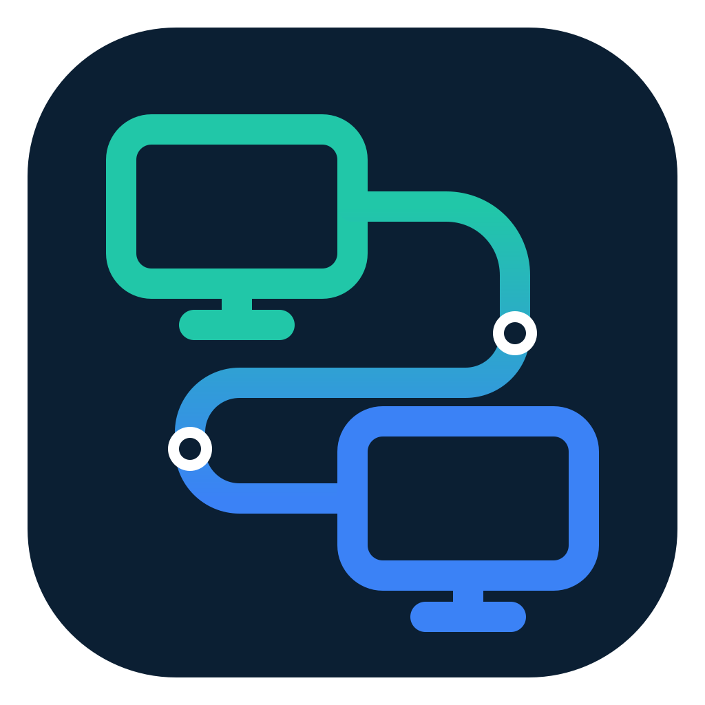
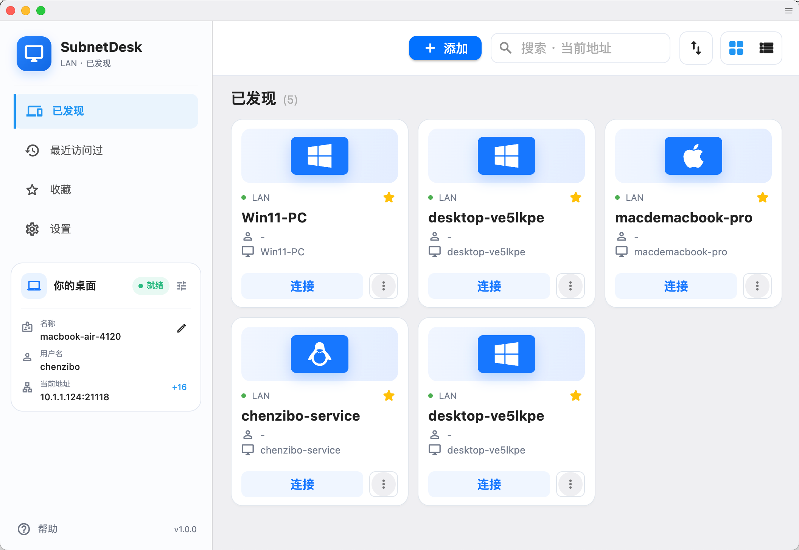
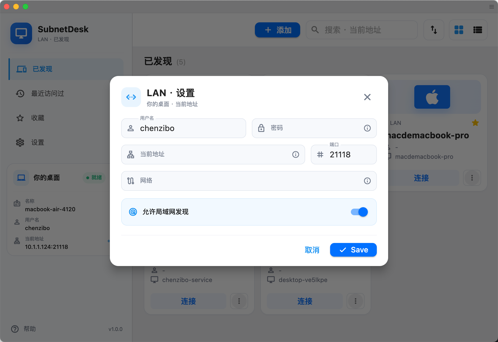

<p align="center">
  
</p>

# SubnetDesk

<p align="center">
  <strong>A LAN-first remote desktop for fast, private, direct connections.</strong>
</p>

<p align="center">
  An independently maintained <a href="https://github.com/rustdesk/rustdesk">RustDesk</a> fork built for LANs, routed private networks, and VPNs.
</p>

<p align="center">
  <a href="https://github.com/zibo-chen/SubnetDesk/releases/latest"></a>
  <a href="https://github.com/zibo-chen/SubnetDesk/releases"></a>
  <a href="https://github.com/zibo-chen/SubnetDesk/stargazers"></a>
  <a href="https://github.com/zibo-chen/SubnetDesk/network/members"></a>
  <a href="https://github.com/zibo-chen/SubnetDesk/actions/workflows/subnetdesk-preflight.yml"></a>
  <a href="LICENCE"></a>
</p>

<p align="center">
  
  
  
  
</p>

<p align="center">
  English · <a href="README.zh-CN.md">简体中文</a>
</p>

<p align="center">
  <a href="#why-subnetdesk">Why SubnetDesk</a> ·
  <a href="#features">Features</a> ·
  <a href="#download">Download</a> ·
  <a href="#quick-start">Quick start</a> ·
  <a href="#build-from-source">Build</a>
</p>

<p align="center">
  
</p>

<a id="why-subnetdesk"></a>

## 💡 Why SubnetDesk

SubnetDesk focuses on one clear use case: remote control between devices that can already reach each other. It removes the public device-ID, rendezvous, relay, cloud account, proxy, and automatic public-update paths from RustDesk, replacing them with direct endpoint connections and local device discovery.

That makes it a good fit for home labs, offices, classrooms, on-site support, and private networks connected by WireGuard, Tailscale, OpenVPN, or another VPN.

| | SubnetDesk | Typical RustDesk deployment |
| --- | --- | --- |
| Connection | Direct IP address or hostname | Device ID through rendezvous, with optional relay |
| Discovery | Automatic mDNS discovery on the LAN | Device ID or address book |
| Server dependency | No coordination server required | Public or self-hosted rendezvous/relay server |
| Best suited for | LANs, routed private networks, and VPNs | Internet and cross-NAT access |

> [!IMPORTANT]
> SubnetDesk does not provide Internet rendezvous or relay services. The two devices must be reachable through the same LAN, a routed private network, or a VPN.

<a id="features"></a>

## ✨ Features

| | Capability | Details |
| --- | --- | --- |
| 🔎 | Local discovery | Find nearby devices automatically over mDNS. |
| ⚡ | Direct connections | Connect by IP address or hostname using a configurable TCP port. |
| 🔐 | Access protection | Authenticate with a username and password; passwords are stored as Argon2id hashes. |
| 🛡️ | Device verification | Verify and remember endpoint fingerprints before trusting a device. |
| 🌐 | Network allowlist | Restrict incoming connections to selected CIDR networks. |
| ⭐ | Fast reconnection | Keep recent devices, favorites, and stable device identities. |
| 🖥️ | RustDesk experience | Retain remote control, clipboard, audio, and file-transfer capabilities without a public coordination server. |

<a id="download"></a>

## 📦 Download

Download stable packages from **[GitHub Releases](https://github.com/zibo-chen/SubnetDesk/releases/latest)**. For the newest changes, use the **[nightly release](https://github.com/zibo-chen/SubnetDesk/releases/tag/nightly)** or artifacts from **[GitHub Actions](https://github.com/zibo-chen/SubnetDesk/actions)**.

| Platform | Architectures | Packages |
| --- | --- | --- |
| Windows | x86_64, ARM64 | `.msi` installer (recommended), portable/no-install `.exe` |
| macOS | Intel, Apple Silicon | `.dmg` |
| Linux | x86_64, ARM64 | `.deb`, `.rpm`, `.AppImage`, `.flatpak`; Arch package on x86_64 |
| Android | ARM64, ARMv7, x86_64, universal | `.apk` |

> [!NOTE]
> Nightly packages are development builds. Prefer the latest stable release for daily use.

<a id="quick-start"></a>

## 🚀 Quick start

1. Install and open SubnetDesk on both devices.
2. On the controlled device, open **LAN settings**, set a username and password, and enable LAN discovery. The default port is `21118`.
3. On the controller, select a discovered device or enter `hostname:port` / `IP:port` manually.
4. Verify the device fingerprint on first connection, then connect.

<p align="center">
  
</p>

### Network checklist

- Both devices can route to each other.
- TCP port `21118` (or your configured port) is allowed by the host firewall.
- mDNS is available when automatic discovery is needed; direct address entry still works without it.
- The controlled device's CIDR allowlist includes the controller's network.
- On Linux, see [host readiness notes](docs/linux-host-readiness.md) for SELinux, Wayland, and login-screen guidance.

## 🔒 Security model

- Traffic stays on the network path between your devices; SubnetDesk does not require a public coordination service.
- Passwords are persisted as Argon2id hashes rather than plaintext.
- Device fingerprints provide trust-on-first-use verification and help detect an unexpected endpoint identity change.
- CIDR allowlists let the controlled device limit which source networks may connect.

As with any remote-control software, expose the listening port only to trusted networks, use a strong unique password, and verify fingerprints through a separate trusted channel when possible.

<a id="build-from-source"></a>

## 🛠️ Build from source

Clone the repository with its submodules, then run the Flutter desktop build:

```bash
git clone --recurse-submodules https://github.com/zibo-chen/SubnetDesk.git
cd SubnetDesk
./build.py --flutter --hwcodec
```

The build requires Rust, Flutter, and platform-specific native dependencies. The [native package workflow](.github/workflows/flutter-build.yml) is the source of truth for pinned tool versions, target architectures, and packaging steps.

## 🤝 Contributing

Bug reports, feature ideas, and pull requests are welcome. Before opening a change, check the existing [issues](https://github.com/zibo-chen/SubnetDesk/issues) and keep changes focused on the LAN/VPN-first product scope.

## 💬 Community

<p align="center">
  <a href="https://discord.gg/MFZG478wPQ">
    
  </a>
</p>

<p align="center">
  Join the <a href="https://discord.gg/MFZG478wPQ">SubnetDesk Discord community</a>, or scan the QR code below to add me on WeChat. Mention <strong>SubnetDesk</strong>, and I will invite you to the WeChat group.
</p>

<p align="center">
  
</p>

## 🙏 Credits and license

SubnetDesk is based on [RustDesk](https://github.com/rustdesk/rustdesk) and retains its open-source foundations. SubnetDesk is an independent project and is not an official RustDesk release.

Licensed under the [GNU Affero General Public License v3.0](LICENCE). Use remote-control software only on systems you own or are authorized to administer.
