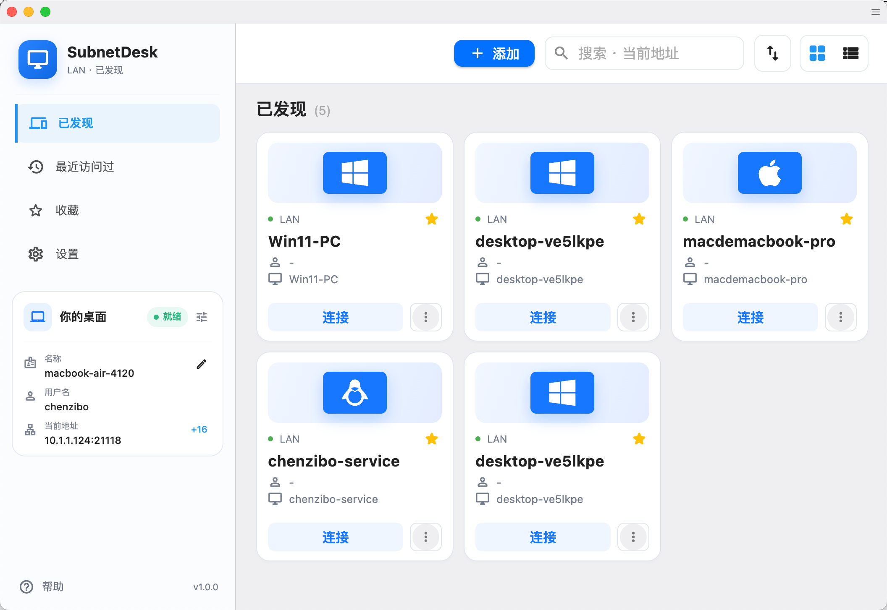
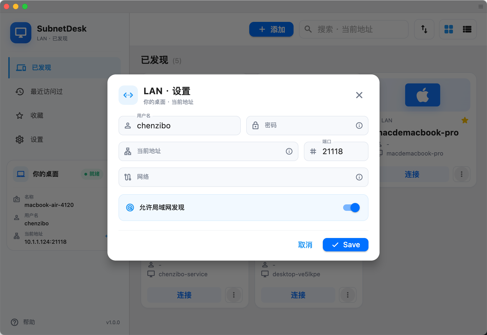

<p align="center">
  
</p>

# SubnetDesk

<p align="center">
  基于 <a href="https://github.com/rustdesk/rustdesk">RustDesk</a> 修改的简洁局域网远程桌面工具。
</p>

<p align="center">
  <a href="README.md">English</a> · 简体中文
</p>

SubnetDesk 是一个独立维护的 RustDesk 分支，面向局域网和 VPN 内的点对点远程访问。项目移除了公网设备 ID、信令服务器、中继、云账号、代理和公网自动更新等路径，改为直接连接地址并自动发现本地设备。



## 主要特点

- 通过 mDNS 自动发现局域网内的设备。
- 使用 IP 地址或主机名直接连接，TCP 端口可配置。
- 使用用户名和密码保护访问，密码以 Argon2id 哈希保存。
- 首次连接时核对设备指纹，避免连接到错误设备。
- 可通过 CIDR 网段限制允许接入的网络。
- 支持最近访问、收藏和快速重连。
- 保留熟悉的 RustDesk 远程控制体验，无需部署公网协调服务器。

> SubnetDesk 不提供公网信令或中继服务。两台设备需要位于同一局域网、可路由的私有网络，或通过 WireGuard、Tailscale、OpenVPN 等 VPN 互通。

## 快速开始

1. 在两台设备上安装并打开 SubnetDesk。
2. 在被控端打开 **LAN 设置**，设置用户名和密码，并开启局域网发现。默认端口为 `21118`。
3. 在控制端选择已发现的设备，或手动输入地址；核对设备指纹后发起连接。



## 下载与构建

Windows、macOS 和 Linux 安装包发布在 [Releases](https://github.com/zibo-chen/SubnetDesk/releases) 页面，持续构建产物也可以在 [GitHub Actions](https://github.com/zibo-chen/SubnetDesk/actions) 中获取。

从源码构建时，请拉取子模块并使用发布工作流中的平台命令：

```bash
git clone --recurse-submodules https://github.com/zibo-chen/SubnetDesk.git
cd SubnetDesk
./build.py --flutter --hwcodec
```

构建需要 Rust、Flutter 和对应平台的原生依赖。固定的工具版本与完整打包步骤以 GitHub Actions 工作流为准。

## 致谢与许可

SubnetDesk 基于 [RustDesk](https://github.com/rustdesk/rustdesk) 开发并保留其开源基础。本项目独立维护，并非 RustDesk 官方发行版。

项目采用 [GNU Affero General Public License v3.0](LICENCE) 许可。请仅在自己拥有或已获授权的设备上使用远程控制功能。
